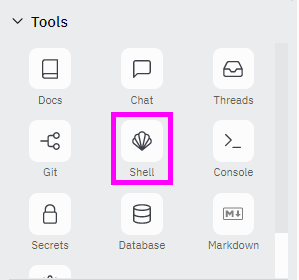
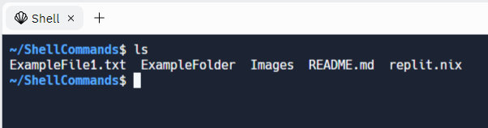

# Using the Command Line in Replit
You can run a command line shell right from Replit!

>Note that a Repl account is required to participate in this activity.

## Getting Started with Replit
First, you'll want to get the a command line up and running.

1. [Click here to open the Starter Repl project.](https://replit.com/@HylandOutreach/ShellCommands)
1. There, lick the "Fork Repl" button in the upper right
1. A pop-up should appear: in the lower right, click the "Fork Repl" button
1. In the new project, find the **Tools** section on the left
1. There, click the **Shell** button:  
    
1. In the bash shell that opens, try entering a command (like `ls`):  
    

Now you're ready to start commanding the mini Repl computer!

## More Bash Commands
There are a ton of different bash commands to try - research them and see what they do! Some of them may require extra information to run, but some of them should run all on their own.

### Basics
- `date`
- `whoami`
- `clear`
- [`cat`↗](https://linuxhint.com/cat-command-bash/)
- [`mkdir`↗](https://ss64.com/bash/mkdir.html)
- [`touch`↗](https://www.geeksforgeeks.org/touch-command-in-linux-with-examples/)
- [`mv`↗](https://www.geeksforgeeks.org/mv-command-linux-examples/)
- [`wc`↗](https://www.geeksforgeeks.org/wc-command-linux-examples/)

### Fun Useless Stuff
- `sl`
- `fortune`
- `cmatrix`
- `aafire`
- `asciiquarium`
- `yes`
- `cowsay`

## Exercises
After researching the commands above, try to complete the following tasks using the command line. It should be possible to complete all of them _without_ using a GUI. Note, some of these tasks will require commands not covered by this lesson. Use Google to figure out which commands are needed!

1. Change the working directory to the **SecretKeys** folder
1. Create a new text file in the directory called "Test.txt"
1. Edit the text file and add a few lines to it
1. Copy the file into another file called "Test2.txt"
1. Create a new directory inside of **SecretKeys** called **Files**
1. Move "Test2.txt" into the Files folder
1. Delete the "Test.txt" file
1. Print out the contents of the "Test2.txt" file
1. Count how many lines and words are in the "Test2.txt" file
1. Print out the full list of recently-used commands
