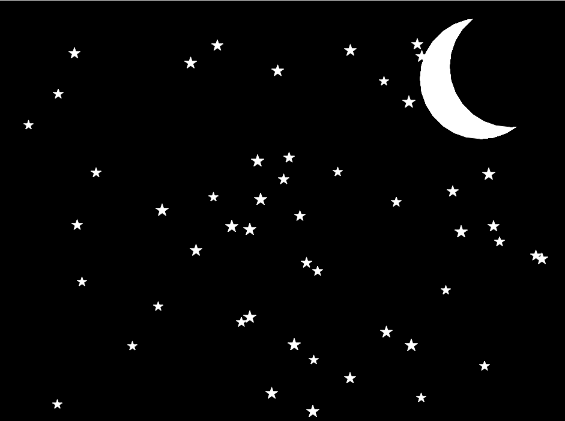
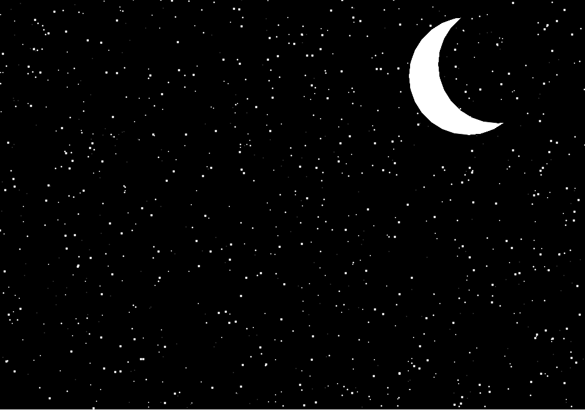
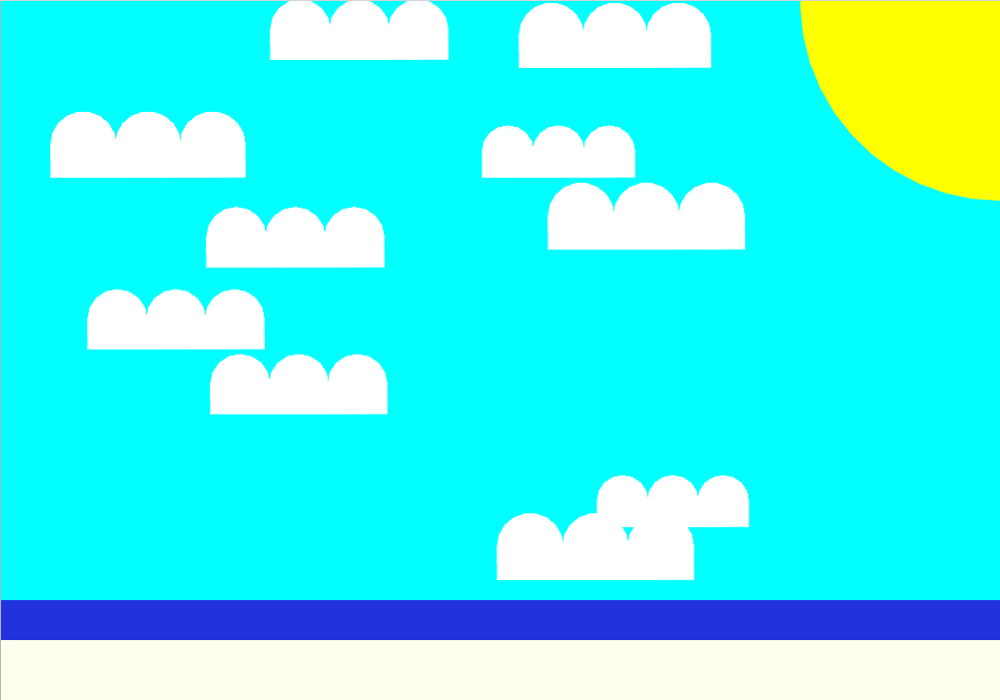

# Challenges: Sky Functions
Try to complete these challenges, or feel free to create your own sky!

## Multi-Colored Aliens
Right now, there are only green aliens. This is cool, but the invasion might be a little scarier if there were aliens of different colors.

**Make green AND purple AND orange aliens appear in the sky.**

### Extra: Multiple Shapes
Right now, all aliens are squares. But some triangle or circle aliens could be cool. Try to add some of those to the sky too.

## Stars AND Aliens
So aliens may be invading, but the stars should also still be present.

**Make both stars AND aliens appear in the sky.**

## Crescent Moon
The moon is cool as a circle, but a crescent moon might look a little more artistic. It could look something like this:



## More Realistic Stars
Right now, the night stars don't look like actual real stars. In fact, simple dots may look more like stars! Luckily, the Turtle library has a `dot` function. For example, for a `plane` object to create a 4-pixel dot, the code would look like this:

```py
plane.dot(4)
```

Update the program so that instead of drawing star shapes, it places one thousand dots of varying small sizes all across the sky. It could end up looking something like this:



## Ground
Add some sort of ground to the scene. This could be a simple brown or green rectangle at the bottom of the canvas, or something a little more involved.

For example, you could try to create a beach scene:


