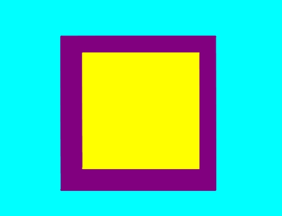
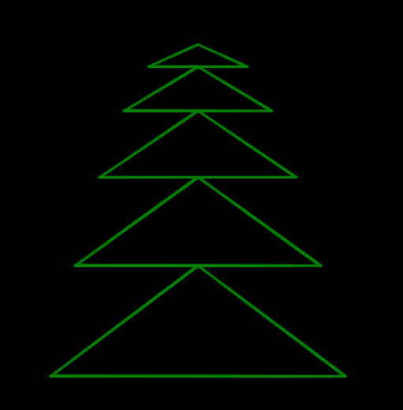

# Looping Turtle Challenges 🐢➰
Loops make it much easier for turtles to do almost anything. Feel free to create anything you'd like, or work on completing any of these challenges.

## Bug Fixing 🐛
[Click here for some bug fixing exercises.](DebuggingLoops.md)

## More Challenges
Here are a few things you can try to do.

### Make a Pentagon

### Make a Seven-Pointed Star

### Make a Filled-In Diamond

### Make a Snowman

### Make a Square Inside of a Square

### Make a Cube

### Make an Evergreen Tree

