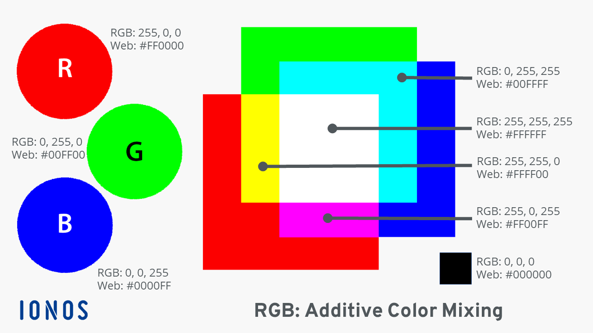

# Color Picker
Play this game to get a better feel for the [(r, g, b) color model](https://en.wikipedia.org/wiki/RGB_color_model).

## Primer
Remember that RGB colors are made up of **R**ed, **G**reen, and **B**lue values. The higher they are, the more of that color there is. Here are some helpful reference points:

Always remember, the first number is **R**ed, the second number is **G**reen, and the third number is **B**lue.

## Game
Play the game below, and try to get a high score. You may want to click the "Restart" button to start with a fresh timer.

<iframe src="./Assets/ColorPicker/ColorPicker.html" width="100%" height="500" frameborder="0" marginwidth="0" marginheight="0" allowfullscreen></iframe>
