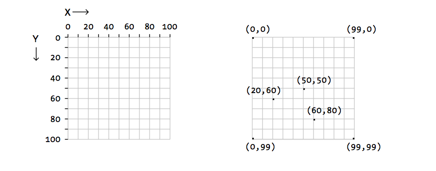

# Coordinate Clicker
Play this game to get a feel for the [Processing coordinate system](https://processing.org/tutorials/coordinatesystemandshapes).

## Primer
Remember that the processing canvas works like this:

For this game, the top left corner is point **(0, 0)**, and the bottom right corner is point **(800, 400)**. The first number is the `x`, or the _horizontal distance_. The second number is the `y`, or the _vertical distance_.

## Game
Play the game here, and try to get a high score. The highest possible score is **10000**.

<iframe src="https://trinket.io/embed/python/d1effbf332?outputOnly=true&runOption=run&start=result" width="100%" height="500" frameborder="0" marginwidth="0" marginheight="0" allowfullscreen></iframe>

>_If there are issues with the embedded game, [click here to load it on a separate page](https://trinket.io/processing/d1effbf332?outputOnly=true&runOption=run)._
