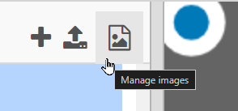

# Trinket Images
Follow this guide to add custom images to a Trinket Processing project.

## Account Setup
[Click here to sign up for a Trinket account](https://trinket.io/signup).

Feel free to click the "Sign in with Google" button, or fill out the form and click the "Sign Up" button at the bottom.

Once you're logged into Trinket, you'll be able to add images!

## Finding an Image
Unfortunately, it is quite difficult to find images that will work well within a Processing project. The images should be small, and they should have a transparent background.

Here is a search tool that will search google images, pre-set to find transparent images with a given size:

<p>Search:
  <input id="search" placeholder="enter a search term">
  <button onclick="window.open(`https://www.google.com/search?tbm=isch&tbs=ic:trans&q=${document.querySelector('#search').value} imagesize:${document.querySelector('#width').value}x${document.querySelector('#width').value}`, '_blank').focus()">Search</button>
</p>
<p>Width & Height: <input id="width" value="32"></p>

This is one way to find images, but feel free to find them any way you'd like! Just try to keep them small so they fit within the canvas.

### Saving the Image
Once an image has been found, save it to your computer. If needed, make sure the file has a short name - this will make it much easier to use in the code.

## Uploading the Image
Now that you're logged into Trinket, and you have an image to use, it's time to upload it to the image library for your project!

1. Click the "Manage images" icon in the upper right of the code area:  
    
1. In the new view, click the "+ Image Library" button:  
    
1. In the new view, click the "Upload New Image" button:  
    
1. There, drag the file from your computer into the Image Library

That should be all that's needed to upload the image into the project!

## Using the Image in Code
Now that an image is in the Trinket, it's time to load it into the Processing project, and draw it on the screen.

### Setup
In the `setup` function definition, create a new global variable to store the image, and call the `loadImage` function to load it. It should look something like this:

```py
def setup():
  global bird
  bird = loadImage("bird.png")
```

### Draw
In the `draw` function definition, call the `image` function to place the stored image on the canvas at a particular location. It should look something like this:

```py
def draw():
  image(bird, 20, 50)
```

That should be it!
